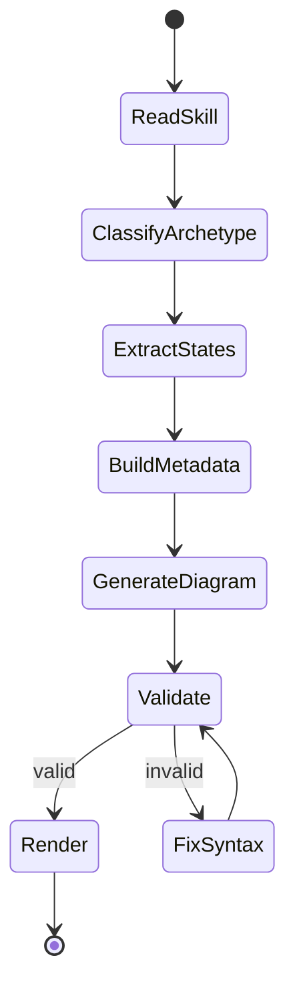
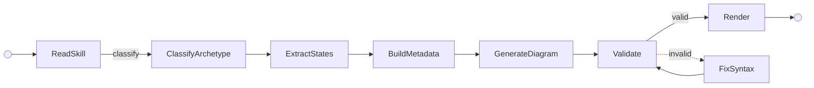

# Skill Statechart

Two modes for mapping between SKILL.md prose and visual statecharts.

## Mode Selection

**Audit mode** — Given a SKILL.md path, extract its workflow as an interactive statechart.
**Design mode** — Given a statechart sketch (states + transitions), scaffold a SKILL.md from it.

Ask the user which mode if ambiguous.

---

## Audit Mode: SKILL.md → Statechart

### Step 1: Read and Classify

Read the target SKILL.md completely. Classify its workflow archetype:

| Archetype | Signal | Example |
|-----------|--------|---------|
| `linear-pipeline` | Numbered phases, sequential flow, no loops | build-workbench, visual-explainer |
| `cyclical-workflow` | Explicit loop/iteration structure, "repeat until" | compound-learning, evolve |
| `interactive-state-machine` | User gates, branching based on user input, resume points | workspace-graduation |
| `parallel-orchestration` | Fork/join, worker teams, concurrent tracks | site-publisher |

A skill may exhibit traits of multiple archetypes. Choose the dominant one — the pattern that best describes the skill's primary control flow.

### Step 2: Extract States

Map SKILL.md prose to states using this taxonomy:

| Prose Pattern | Maps To |
|---------------|---------|
| Numbered phases ("Phase 1", "Step 1") | Named states |
| Phase sub-steps ("1. Do X, 2. Do Y") | `actions` array within the state |
| "Exit condition" / gate / "before proceeding" | Guard conditions on transitions |
| "Wait for user" / "ask the user" / "get approval" | `user-gate` state type |
| "If error" / "fallback" / "on failure" | Error transitions |
| "Repeat" / "loop until" / "iterate" | Cycle edges back to earlier state |
| "In parallel" / "fork" / "spawn workers" | `fork`/`join` state types |
| Session start routing / "if resuming" | `choice` pseudostate |
| "Run /skill:name" / "invoke" / "delegate" | `invokes` metadata |
| File reads ("read X.md", "load context") | `reads` array |
| File writes ("write to", "output", "create") | `writes` array |
| "Done" / "deliver" / "complete" | `end` state type |

**Naming rules:**
- State IDs: PascalCase, descriptive (e.g., `ReadSkill`, `ClassifyArchetype`, `UserApproval`)
- Every skill has exactly one `start` state and at least one `end` state
- Preserve the skill's own phase/step numbering in the `phase` field

**What to capture vs. skip:**
- Capture: every decision point, every user interaction, every file I/O, every sub-skill invocation
- Skip: internal implementation details that don't affect control flow (CSS choices, prompt wording, library selection)

### Step 3: Build Metadata JSON

Produce a JSON object following this schema:

```json
{
  "skill": {
    "name": "string — skill name from frontmatter",
    "description": "string — one-line purpose",
    "archetype": "linear-pipeline | cyclical-workflow | interactive-state-machine | parallel-orchestration",
    "source": "path/to/SKILL.md",
    "lead": "string — 1-2 sentence creative description of the skill's philosophy and approach",
    "triggers": [
      { "title": "string — trigger name (e.g. User Request)", "description": "string — when and why this trigger fires" }
    ],
    "phases": [
      { "name": "Phase 1 — Name", "title": "string — short creative title", "description": "string — editorial summary of what this phase accomplishes, 2-3 sentences" }
    ],
    "decisions": [
      { "label": "string — short category label", "name": "string — option name", "detail": "string — one-line supporting detail" }
    ],
    "references": ["file1.md", "file2.md"]
  },
  "states": {
    "StateId": {
      "title": "Human-readable Name",
      "phase": "Phase N | null",
      "description": "What this state does — 1-2 sentences",
      "actions": ["sub-step 1", "sub-step 2"],
      "reads": ["file.md", "another.md"],
      "writes": ["output.md"],
      "guards": [
        {
          "label": "condition text",
          "target": "NextStateId",
          "type": "proceed | block | fallback"
        }
      ],
      "invokes": ["/skill:name"],
      "exitMessage": "Transition prompt text | null",
      "type": "normal | start | end | choice | fork | join | user-gate | error"
    }
  }
}
```

**Field rules:**
- `guards` connect to their target state: `proceed` is the happy path, `block` halts execution, `fallback` redirects to an alternative path
- `reads`/`writes` use relative paths from the skill root
- `invokes` uses `/workbench:skill` namespacing
- `exitMessage` captures the literal transition prompt if the skill defines one (e.g., "Deliver the HTML and tell the user the file path")
- `choice` states must have multiple guards with different targets
- `user-gate` states pause execution until the user responds
- `error` states represent failure/recovery paths

**Editorial field rules:**
- `lead` is a creative hook — engaging prose, not a dry restatement of `description`
- `triggers` are extracted from the start state and any proactive activation conditions in the SKILL.md
- `phases` correspond to the major phase divisions in the SKILL.md (Phase 1, Phase 2, etc.) — write editorial summaries that explain what the phase accomplishes and why
- `decisions` are surfaced from `choice` states — each guard option on the most significant choice becomes a decision step (e.g., template selection, rendering approach). Only surface the single most important decision; skip trivial binary choices
- `references` are all unique files from `reads` arrays across all states, deduplicated

### Step 4: Generate Mermaid Diagram

**Diagram type selection:**
- Use `stateDiagram-v2` when all labels are plain text (no colons, parentheses, HTML entities, or special characters) AND state count ≤ 15
- Use `flowchart LR` for everything else — it handles special characters, scales better, and supports richer styling

**stateDiagram-v2 conventions:**



**flowchart LR conventions:**



**Styling with classDef:**

Apply a `classDef` for each state type using the brand palette:

| State Type | Fill | Border | Shape |
|------------|------|--------|-------|
| `normal` | `#6b7c5e1a` (sage, 10%) | `#6b7c5e` (sage) | Rectangle |
| `start` / `end` | Mermaid default | Mermaid default | Filled circle |
| `choice` | `#b8a88a1a` (gold, 10%) | `#b8a88a` (muted gold) | Diamond |
| `user-gate` | `#c4704b1a` (terracotta, 10%) | `#c4704b` (terracotta) | Stadium/rounded |
| `error` | `#c4704b0d` (terracotta, 5%) | `#c4704b` dashed | Rectangle |
| `fork` / `join` | `#8a85781a` (gray, 10%) | `#8a8578` (warm gray) | Horizontal bar |

Example classDef block (flowchart):
```
classDef normal fill:#6b7c5e1a,stroke:#6b7c5e,stroke-width:1.5px
classDef choice fill:#b8a88a1a,stroke:#b8a88a,stroke-width:1.5px
classDef userGate fill:#c4704b1a,stroke:#c4704b,stroke-width:1.5px
classDef error fill:#c4704b0d,stroke:#c4704b,stroke-width:1.5px,stroke-dasharray:5 5
classDef forkJoin fill:#8a85781a,stroke:#8a8578,stroke-width:2px
```

Assign classes to nodes: `class ReadSkill,ExtractStates,BuildMetadata normal`

**Edge styling:**
- Happy path: solid arrows (`-->`)
- Error/fallback path: dotted arrows (`-.->`)
- User-gate transitions: thick arrows (`==>`)
- Cycle/loop edges: styled with a label indicating the loop condition

### Step 5: Validate

If `./scripts/validate-mermaid.sh` is available, pipe the Mermaid code through it:

```bash
echo "$MERMAID_CODE" | ./scripts/validate-mermaid.sh
```

Exit 0 → proceed. Exit 2 → fix syntax errors and re-validate.

**Common Mermaid pitfalls and fixes:**
- Colons in labels → replace with dashes or "then"
- Parentheses in labels → remove or use square brackets
- HTML entities in stateDiagram → switch to flowchart LR
- Quotes inside quoted flowchart labels → escape or rephrase
- Long labels → abbreviate, move detail to the metadata panel
- Node IDs starting with numbers → prefix with a letter

### Step 6: Render

Generate the HTML using `./templates/skill-statechart.html` as the template. The output combines **editorial sections** (narrative explanation of the skill) with an **interactive statechart** (Mermaid diagram + clickable detail panel).

**Page structure (top to bottom):**

1. **Hero** — Skill name as italic h1, badges (archetype, version if known), and the `skill.lead` paragraph. Sets the creative tone for the page.
2. **Trigger cards** — 3-column grid from `skill.triggers`. Each card has a mono-font title and body text. Wrapped in a hero-depth card labeled "When This Skill Fires".
3. **Flow arrow** — Inline SVG down-arrow with a mono label describing the transition (e.g., "triggers the two-phase workflow").
4. **Phase cards** — One card per entry in `skill.phases`. Each has a colored dot label (accent for early phases, secondary for later phases), italic h3 from `phase.title`, and body paragraph from `phase.description`. Flow arrows between cards.
5. **Decision pipeline** — If `skill.decisions` has entries, render a horizontal pipeline row: each option as a step card with label, name, and detail. Wrapped in a gold-labeled card. If no meaningful decisions, skip this section.
6. **Reference pills** — From `skill.references`. Each file as a monospace pill in a flex-wrap row. Wrapped in a recessed card with a gold dot label.
7. **KPI row** — Computed from states: count states, transitions (sum of all guards), guards (guards with type != proceed), user gates, file reads (deduplicated), file writes (deduplicated).
8. **Interactive statechart** — Split-pane grid: Mermaid diagram (left, with zoom controls) + detail panel (right, sticky). Click a node in the diagram to see its metadata — actions, reads, writes, guards, exit message.
9. **Legend** — Only include state types and edge types that actually appear in this diagram.

**Embed two data blocks in the HTML:**

1. The Mermaid diagram code in a `<pre class="mermaid">` block inside `.mermaid-wrap`
2. The full metadata JSON (including editorial fields) in a `<script type="application/json" id="statechart-meta">` block

**Editorial tone:** The editorial sections should read like a well-written skill overview — engaging, specific, and useful. Avoid generic filler. Each phase card should explain *why* the phase exists, not just list what it does.

**Output to:** `~/.agent/diagrams/{skill-name}-statechart/{skill-name}-statechart.html`

Open in browser after writing.

---

## Design Mode: Statechart → SKILL.md

### Step 1: Sketch

Work with the user to define states and transitions interactively. Start with these questions:

1. "What's the skill's name and purpose?" → `skill.name`, `skill.description`
2. "What's the first thing the agent does?" → `start` state
3. For each state: "What happens next? Any decisions?" → transitions and `choice` states
4. "Where does the user need to approve or provide input?" → `user-gate` states
5. "What files does the agent read or write?" → `reads`/`writes` arrays
6. "Does it invoke other skills?" → `invokes` array
7. "How does it end? Multiple end states?" → `end` states
8. "What can go wrong?" → `error` states and fallback edges

Build the metadata JSON incrementally. Render a preview statechart after each significant addition so the user can see the flow taking shape and course-correct early.

### Step 2: Scaffold SKILL.md

From finalized metadata, generate SKILL.md sections:

| Metadata | SKILL.md Section |
|----------|-----------------|
| `skill.name`, `skill.description` | Frontmatter (`name`, `description`) |
| States ordered by flow | Phase sections with numbered headings |
| `state.actions` | Numbered sub-steps within each phase |
| `state.guards` with `type: proceed` | "Exit condition" / "Gate" blocks at phase boundaries |
| `state.guards` with `type: block` | "Do not proceed if..." warning blocks |
| `state.guards` with `type: fallback` | "If [condition], fall back to [action]" blocks |
| `state.reads` | "Read X" / "Load context from Y" instructions |
| `state.writes` | "Write output to Z" / "Save to" instructions |
| `state.invokes` | "Run /skill:name" references |
| `user-gate` states | "Wait for user approval before proceeding" directives |
| `error` states | "If [condition], fall back to [action]" blocks |
| `choice` states at skill entry | "If resuming from [state], skip to [phase]" routing |
| `choice` states mid-flow | "If [condition A], proceed to [Phase X]. If [condition B], proceed to [Phase Y]." |

**Scaffolding rules:**
- Phase numbering follows the topological order of states in the graph
- Each phase heading includes the state title: `### Phase {N}: {state.title}`
- Sub-steps within a phase use numbered lists matching `state.actions`
- Guard conditions appear as bold callout lines: **Gate:** {guard.label}
- File references use relative paths from the skill root
- The scaffold is a starting point — the user will flesh out the prose

### Step 3: Review

Render the final statechart alongside the scaffolded SKILL.md. The user validates that:

- Every state has a corresponding SKILL.md section
- Every guard appears as an exit condition or decision block
- Every read/write is referenced in the prose
- Every sub-skill invocation is present
- The SKILL.md reads naturally, not like generated boilerplate
- The control flow matches what the user intended

Iterate on both the statechart and the SKILL.md until the user is satisfied. The statechart is the source of truth — SKILL.md is derived from it.
